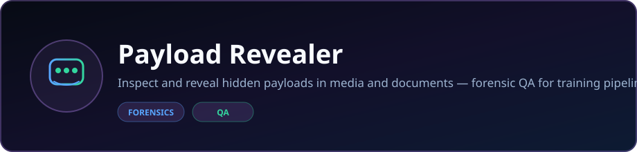
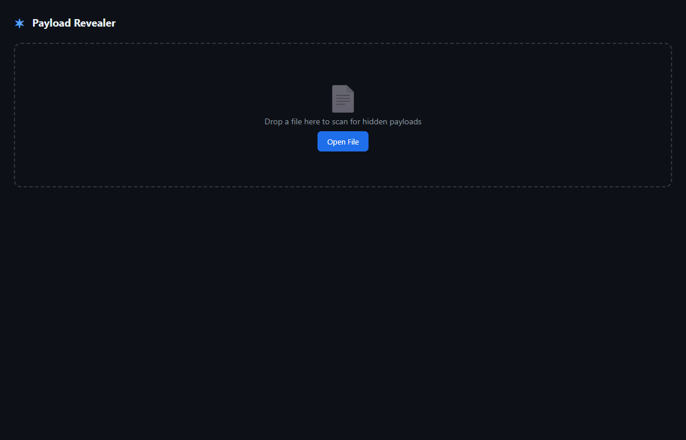

<p align="center">
  
</p>

<p align="center">
  <strong>Inspect and reveal hidden payloads in media and documents — forensic QA for training pipelines.</strong>
</p>

<p align="center">
  <a href="https://dacameragirl.github.io/payload-revealer/"></a>
  <a href="https://github.com/DaCameraGirl/payload-revealer"></a>
</p>

<p align="center">
  
  
</p>

### Languages

<p align="center">
  
  
  
</p>

### Stack

<p align="center">
  
  
</p>

<p align="center">
  Built by <strong>Angela Hudson</strong> · <a href="https://github.com/DaCameraGirl">DaCameraGirl</a>
</p>
# Payload Revealer

[](https://github.com/DaCameraGirl/payload-revealer/actions/workflows/ci.yml)
[](https://github.com/DaCameraGirl/payload-revealer/releases/tag/v1.0.0)
[](https://github.com/DaCameraGirl/payload-revealer/releases/download/v1.0.0/payload_revealer_engine-v1.0.0-win64.exe)

**Hidden Unicode payload scanner & steganography detector.**  
Built for DFIR analysts, developers, and AI output auditing.

Scans any text file for invisible characters, Unicode control codes, zero-width steganography, Bidi override attacks, and hidden metadata — then extracts decoded payloads into a readable forensic report.



<p align="center"></p>
<p align="center"></p>


**[Download payload_revealer_engine-v1.0.0-win64.exe](https://github.com/DaCameraGirl/payload-revealer/releases/download/v1.0.0/payload_revealer_engine-v1.0.0-win64.exe)** — 7.2MB standalone Windows executable, no Python required. Drag a file onto the drop zone or click Open File.

Or use the CLI with Python:

```bash
pip install -e .
python -m payload_revealer tests/fixtures/forensic_report.txt
```

The fixture contains 312 zero-width characters encoding a hidden beacon URL:

```
beacon://c2-exfil.lan/reg?agent=demo-01
```

<p align="center"></p>
<p align="center"></p>


- **Character Count Scanner** — Total character count even if content is invisible
- **Invisible Payload Detector** — Flags zero-width spaces, Unicode control characters, bidirectional overrides, invisible whitespace, Unicode tags, and other hidden text artifacts
- **Visualizer Panel** — Shows hidden content in decoded, readable format
- **Word Count Tracker** — Actual word count vs. visible word count
- **Export Option** — Save decoded payload as `.txt` or `.json` forensic artifact

<p align="center"></p>
<p align="center"></p>


```bash
git clone https://github.com/DaCameraGirl/payload-revealer.git
cd payload-revealer
npm install
pip install -e .
```

<p align="center"></p>
<p align="center"></p>


### Desktop App (Electron)

```bash
npm start
```

### CLI Headless Mode

```bash
# Quick scan
python -m payload_revealer ./suspicious.txt

# JSON output
python -m payload_revealer ./suspicious.txt --format json

# Save report
python -m payload_revealer ./suspicious.txt --output report.json

# Batch scan a directory
python -m payload_revealer ./suspicious_docs/ --recursive
```

### CLI Options

| Flag | Description |
|------|-------------|
| `--format, -f` | `text`, `json`, or `txt` (default: text) |
| `--output, -o` | Save report to file |
| `--recursive, -r` | Recurse into directories |
| `--min-risk` | Filter findings: `critical`, `high`, `medium`, `low`, `none` |
| `--quiet, -q` | Suppress non-result output |
| `--version` | Show version |

<p align="center"></p>
<p align="center"></p>


| Category | Examples | Risk |
|----------|----------|------|
| Zero-width spaces | `U+200B`, `U+200C`, `U+200D`, `U+FEFF` | Critical |
| Bidi overrides | `U+202A`–`U+202E` (LRE, RLO, etc.) | Critical |
| Unicode tags | `U+E0001`–`U+E007F` (hidden metadata) | Critical |
| C0/C1 controls | `U+0000`–`U+001F`, `U+0080`–`U+009F` | High |
| Variation selectors | `U+FE00`–`U+FE0F`, `U+E0100`–`U+E01EF` | Medium |
| Private Use Areas | `U+E000`–`U+F8FF`, `U+F0000`–`U+10FFFF` | Medium |
| Invisible whitespace | NBSP, en-space, ideographic space | Low |
| Noncharacters | `U+FFFE`, `U+FFFF`, etc. | High |

<p align="center"></p>
<p align="center"></p>


Bundle the Python engine into a single `.exe` (no Python installation required):

```bash
pip install pyinstaller
pyinstaller payload_revealer_engine.spec
```

The output goes to `dist/payload_revealer_engine.exe`. Electron auto-detects it and uses it instead of `python -m`.

<p align="center"></p>
<p align="center"></p>


```
payload_revealer/
├── payload_revealer/       # Python engine
│   ├── engine/
│   │   ├── sweeper.py      # Core character scanner
│   │   ├── classifier.py   # Unicode category tagging
│   │   ├── payload_extractor.py  # Hidden message reconstruction
│   │   ├── word_counter.py  # Visible vs actual word count
│   │   ├── export_engine.py # JSON/TXT report export
│   │   └── ipc_bridge.py   # JSON-RPC for Electron
│   └── cli/
│       └── reveal.py       # CLI headless mode
├── electron/               # Desktop shell
│   ├── main.js             # Electron main process
│   ├── preload.js          # Secure IPC bridge
│   └── renderer/           # UI
│       ├── index.html
│       ├── style.css
│       └── renderer.js
└── package.json
```

<p align="center"></p>
<p align="center"></p>


MIT